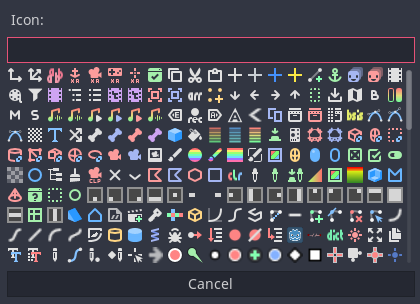
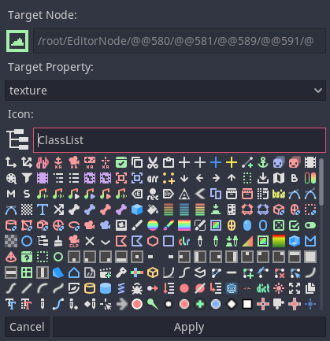
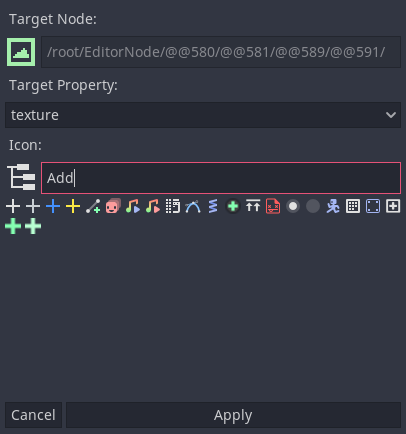

# Iconify

Iconify offers an easily accessible Icon picker so you can focus on building a good editor UI without constantly switching tabs to assign them via script.

## Features

- Search icons by name
- Automatically assign icons to node properties
- View all built-in editor icons to use them in a script
- Keyboard shortcuts for extremely fast UI design

## How-to

### Icon Browser

> Ctrl+I or Project > Tools > Icon Browser

Browse through all built-in godot icons with the grid, or search with the input field above. Click on an icon in the grid to reveal the name.

### Iconify

> Shift+Ctrl+I or Project > Tools > Iconify

When executed while having a node selected in the SceneTree, the Iconify menu with an embedded icon browser will popup, you can now select your desired icon and what property to assign it to. Press `Enter` or the Apply button to apply the changes

Searching:

## Installation

Automatic:
- Search "Iconify" in the Asset Library
- Click Download, then install
- In `Project Settings` > `Plugins` set `Iconify` to `Enabled`

Manual:

- Copy the `Iconify` folder (inside `addons`) and paste it in your project's `addons` folder (folder **must** be named exactly `addons`, otherwise godot wont detect it)
- Enable the addon inside Project > Project Settings > Plugins > Click `Enable` for the Iconify plugin
